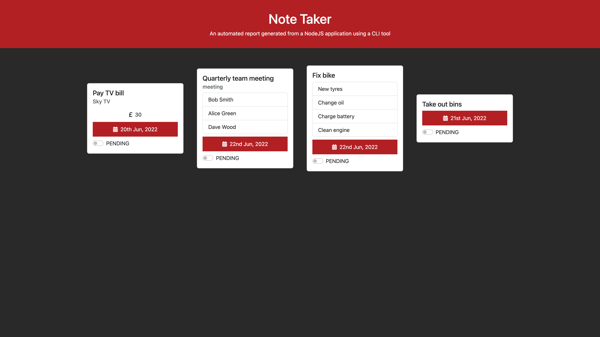

# Note Taker Inquirer

## User Stories

```
AS a user I want to use the CLI to generate a note-taker HTML report
```

## Acceptance Criteria

```
AS a user I should be able to add a note on bills
AS a user I should be able to add a note on appointments
AS a user I should be able to add a note on lists
AS a user I should be able to add a note on flashcards
AS a user I should be able to populate a single type of note
AS a user I should be able to view all of my notes in the HTML report
AS a user I should be able to use the dynamically created report to store the status of my notes in Local Storage
AS a user I should be able to update the status of my notes on the client
```

## Screenshot



## Getting Started

```
git clone git@github.com:surajverma2587/note-taker-inquirer.git
cd note-taker-inquirer
npm i
npm run start
```
